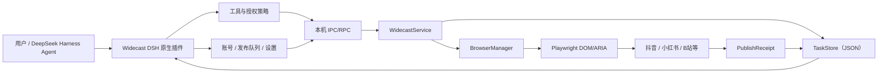
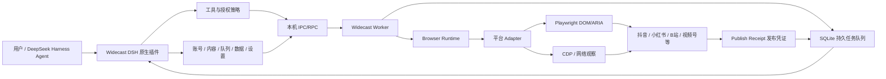

# Widecast 技术总规划

> 状态：Phase 0 已完成，Phase 1（抖音可靠闭环）进行中
> 目标读者：项目所有者、开发 Agent、后续贡献者
> 基线日期：2026-08-18（v0.5.0 更新：状态/幂等/认证/发布证明硬化）
> 项目目录：`E:\自媒体\widecast`

## 0. 给开发 Agent 的执行入口

开始写代码前，必须完整阅读本文件，然后依次阅读：

1. `README.md`
2. `package.json`
3. `src/index.ts`（DSH 工具层客户端）
4. `src/client.ts`（Widecast 客户端）
5. `src/server.ts`（Widecast 独立服务）
6. `src/types.ts`
7. `src/platforms.ts`
8. `src/browser.ts`
9. `src/publish.ts`
10. `src/service.ts`
11. `src/tasks.ts`
12. `src/client/index.tsx`

执行规则：

- 按本文"阶段计划"顺序实施，不得直接跳到批量增加平台。
- 每个阶段单独提交，提交前运行类型检查、构建和该阶段测试。
- Widecast 仓库只接收自主实现或通过来源与许可证审计的代码和资源。
- 当前使用的模型没有视觉输入，核心功能必须在这一环境下完整可用；具体实现技术由实施者按效率和稳定性选择。
- 可以研究产品的公开行为和公开页面，然后以 clean-room 方式独立实现同类能力。
- 任何平台都必须通过验收矩阵后，才可以在 UI 和 Agent 工具中标记为"可发布"。
- 对真实账号执行发布、删除等写操作前，先使用测试账号或草稿模式验证。

### ⚠️ 重要：Widecast 独立服务架构

**Widecast 采用独立服务架构，不需要重启 DSH！**

```
架构：
DSH ←→ Widecast 客户端（src/index.ts）←→ Widecast 独立服务（src/server.ts）

启动顺序：
1. 启动 Widecast 服务：pnpm serve（端口 18080）
2. 启动 DSH：dsh --profile web
3. DSH 通过 HTTP RPC 调用 Widecast 服务

代码修改后：
- 只需重启 Widecast 服务（pnpm serve）
- 不需要重启 DSH
- 支持热重载（pnpm serve:dev）
```

---

## 1. 一句话技术决策

Widecast 采用：

**以 DeepSeek Harness 原生插件承载 Agent 能力，选择最高效、最稳定的本地执行方式完成账号管理和多平台发布，并用持久任务记录与多信号发布凭证证明每次发布结果。当前推荐从 TypeScript + Playwright + 本地 Worker + SQLite 起步，但实施者可在验证收益后调整具体组件。**

这不是一个"让大模型一直看截图、猜坐标"的项目，也不是蚁小二的换皮。它是一个 Agent 可调用、可审计、可恢复、可扩展的本地自媒体操作系统。**模型即使完全没有视觉能力，Widecast 的全部核心功能也必须可用。**

---

## 2. 产品目标

### 2.1 必须做到

- Agent 能查询、添加和检查用户自己的平台账号。
- Agent 能管理内容草稿、平台变体、素材和发布计划。
- Agent 能发布视频、图文和文章，并支持草稿、立即发布、定时发布。
- Agent 能查询任务进度和历史，不需要用户每天重复操作网页。
- 每次发布都能回答：发了什么、发到哪个账号、什么时候发的、平台是否接受、作品 ID/链接是什么、证据在哪里。
- 没有人为设置的"每日三次"等本地配额；吞吐量只受机器资源、用户策略和平台真实限制约束。
- 登录、Cookie、页面原始数据和账号资料保留在本机，不进入模型上下文。
- 浏览器或 DSH 重启后，任务可恢复，不能丢失状态或重复发布。
- 后续可以增加平台适配器，而不改动 Agent 工具协议和核心任务系统。

### 2.2 用户只应在这些情况接管

- 首次登录、扫码、验证码、二次验证。
- 平台出现风险提示、实名确认或协议确认。
- Agent 无法判断内容合规或目标账号存在歧义。
- 删除作品、彻底登出账号等高影响操作，除非用户预先配置了明确授权策略。

### 2.3 项目范围边界

- 登录验证码、二次验证和风险确认由真人接管。
- 平台操作优先使用官方能力和用户正常登录后的浏览器页面。
- Widecast 独立实现目标功能，不把第三方商业软件作为运行依赖。
- 平台自身的频率、审核和账号规则属于运行环境约束，应在任务系统中正确呈现。

---

## 3. 浏览器为什么能被 Agent 操作

### 3.1 浏览器并不是一张只有像素的图片

网页通常同时存在四层信息：

1. **DOM**：按钮、输入框、文本、属性和层级结构。
2. **可访问性树（ARIA/Accessibility Tree）**：把页面整理成"按钮、文本框、标题、列表"等语义节点。
3. **浏览器协议与事件**：导航、请求、响应、下载、弹窗、控制台和页面生命周期。
4. **像素画面**：最终供人观看的渲染结果；Widecast 不把这一层作为 Agent 输入。

Playwright 可以直接读取前三层，因此模型没有视觉能力也不妨碍完成普通网页操作。实施时优先选择结构化数据，因为它通常更快、更稳定。

推荐操作示例：

```ts
await page.getByRole('button', { name: '发布', exact: true }).click()
await page.getByLabel('标题').fill(title)
await page.locator('input[type=file]').setInputFiles(videoPath)
const snapshot = await page.ariaSnapshot()
const response = await page.waitForResponse(r => isPublishResponse(r))
```

这种方式比"截图 → 模型看图 → 猜坐标 → 模拟鼠标"更快、更便宜、更容易验证。

### 3.2 为什么现在的 Agent 默认不能读取浏览器一切

原因主要不是"页面全加密"，而是权限和边界：

- Agent 默认没有连接到浏览器进程；需要 Playwright、CDP、扩展或 MCP 作为桥梁。
- Cookie、令牌和登录状态属于高敏感数据，不能直接放进模型上下文。
- HttpOnly Cookie 不能被网页 JavaScript 读取，但浏览器仍会自动携带；自动化工具只需要复用会话，不需要把 Cookie 交给 Agent。
- 跨域 iframe、关闭的 Shadow DOM、Canvas、视频帧、系统文件选择器和浏览器自身 UI 不一定暴露成普通 DOM。
- 页面可能动态加载或频繁改版，需要等待、重试和多种定位方式。
- 让模型读取完整 DOM 会产生大量噪声和提示词注入风险，所以应只提供最小、可信、结构化的页面状态。

结论：**Agent 可以拥有浏览器能力，但不能把浏览器中的全部敏感数据无边界地喂给模型。** Widecast 应把浏览器操作封装成受控工具。

### 3.3 当前模型能力假设

当前用于管理 Widecast 的模型没有视觉输入，因此任何需要模型参与的核心流程都要提供文本或结构化状态。这个约束描述的是运行环境，不是禁止开发者使用截图、录屏等工具辅助人工调试。

遇到 DOM/ARIA 不可访问的 Canvas 或浏览器原生控件时，处理顺序是：

1. 检查平台是否同时提供普通 DOM、键盘操作或可访问性节点。
2. 通过 CDP、页面 JavaScript 运行时、事件监听或网络状态获取结构化信息。
3. 通过标准键盘命令、文件上传 API 或浏览器事件完成操作。
4. 如果仍无可靠的非视觉接口，将该步骤标记为 `human_required`，不让 Agent 猜坐标。

故障诊断优先使用精简 DOM、ARIA snapshot、CSSOM/布局数据、MutationObserver、URL、控制台、网络事件和 Playwright trace。可以保留截图供人检查，但核心 Agent 不能依赖模型理解截图才能继续运行。

---

## 4. 技术路线对比与最终选择

| 路线 | 优点 | 缺点 | Widecast 中的定位 |
|---|---|---|---|
| 官方平台 API | 最稳定、结构化、易验证 | 国内平台开放能力不统一，权限申请困难 | 有官方能力时优先使用 |
| Playwright DOM/ARIA | 快、确定、低成本、可测试 | 平台改版时需维护适配器 | **生产主链** |
| CDP/网络事件 | 可观察请求、响应、DOM、存储和性能事件 | 协议层更底层，需谨慎维护 | 登录探测、上传进度、结果证明 |
| Playwright MCP | Agent 可通过结构化可访问性快照探索网页 | 每步都走模型时成本更高，运行链较长 | 调试、适配器开发、故障侦察 |
| Stagehand 类语义操作 | `act/extract/observe` 能处理页面变化 | 依赖模型，结果不如固定流程确定 | 可评估其非视觉结构化能力，证明有效后再采用 |
| Browser Use | 成熟的通用浏览器 Agent、恢复循环强 | Python/Rust 技术栈与当前 TS 项目割裂，部分模式需要视觉模型 | 作为候选方案评估，不做默认核心 |
| Skyvern | 通用工作流和自托管能力完整 | 部署较重，部分执行路径需要视觉模型，AGPL | 作为候选方案评估许可证与无视觉模式 |
| 纯截图 Computer Use | 能覆盖部分只提供像素的界面 | 当前模型不可用，且效率和确定性较低 | 不作为当前项目路线 |
| MatrixMedia | 已有多个国内平台 CLI/MCP 与流程经验 | GPL-2.0、旧 Electron 栈、与当前会话模型不一致 | 行为参考或未来可选外部连接器 |
| social-auto-upload | Python 脚本较轻、平台案例多 | README 声称 MIT，但当前缺少实际 LICENSE 文件 | 仅做公开行为对照，不复制代码 |
| Prism | 完整任务后台和多平台架构 | Apache-2.0，但引用上游项目且部署较重 | 参考任务模型；代码采用前逐文件审计 |

### ADR-001：核心能力不依赖模型视觉

原因：当前模型没有视觉输入，而且自媒体发布是高重复、字段明确、结果需要证明的工作。核心验收条件是：使用无视觉能力的模型也能完成全部自动发布流程；人工调试和开发工具不受此限制。

### ADR-002：Playwright 直接集成优先于 Playwright MCP

生产流程直接调用 Playwright API。MCP 适合开发 Agent 探索页面和修复适配器，但不是每次发布的必经层。这样减少一次协议转发和多轮模型决策。

### ADR-003：使用混合自动化

执行优先级固定为：

```text
官方 API（若可用）
  → 已测试的确定性 Playwright 流程
  → DOM/ARIA/CDP 结构化定位恢复
  → 请求真人接管
```

### ADR-004：DeepSeek Harness 插件与发布 Worker 分离

DSH 插件负责 Agent 工具、权限、UI 和状态展示；本地 Worker 负责浏览器、队列、定时任务、断点恢复和平台适配器。

原因：DSH 刷新或升级不能中断正在上传的视频，长任务也不应阻塞插件宿主。

**v0.5.0 更新**：当前版本采用“DSH 插件 + 独立 HTTP 服务”架构。服务仍使用 JSON 任务存储和单进程账号级串行队列；Worker/SQLite 分离仍在 Phase 2，不能把当前服务描述成 durable Worker。

### ADR-005：TypeScript 作为唯一主语言

当前 DSH 插件和 Playwright 均为 TypeScript/Node.js。保持单一主语言可复用类型、降低 Windows 部署复杂度。Python 项目只作为研究参考或独立可选连接器。

---

## 5. 目标架构

### 5.1 当前架构（v0.2.0）



### 5.2 目标架构（Phase 2+）



### 5.3 控制面：DSH 原生插件

职责：

- 注册模型可调用工具。
- 校验参数和用户授权策略。
- 展示账号、发布队列、结果和诊断信息。
- 启动或连接本地 Worker。
- 将长任务注册为 DSH 后台任务，但不在插件进程里执行上传。
- 永不把 Cookie、完整 DOM、平台令牌或敏感页面内容返回给模型。

### 5.4 执行面：本地 Worker（Phase 2）

职责：

- 单实例运行，开机或 DSH 启动时自动拉起。
- 从 SQLite 领取任务并保存每一步状态。
- 管理每个账号的独立浏览器会话。
- 执行平台适配器。
- 捕获 trace、DOM/ARIA 快照、网络证明和错误现场；可生成仅供人查看的诊断截图。
- 任务重试、恢复、取消、超时和幂等控制。

第一版 IPC 推荐使用本机命名管道或仅绑定 `127.0.0.1` 的随机端口，并使用启动时生成的短期令牌。不得开放到局域网，不允许无认证 HTTP 写操作。

### 5.5 数据面：SQLite（Phase 2）

从当前 `accounts.json` 和 `tasks.json` 迁移到 SQLite。核心表：

- `accounts`：平台、显示名、profile 引用、状态、最后检查时间。
- `contents`：原始内容、素材、标签、内容指纹。
- `variants`：每个平台对应的标题、正文、封面和平台字段。
- `jobs`：发布计划、状态、优先级、目标账号、幂等键。
- `attempts`：每次尝试的步骤、错误、耗时和恢复位置。
- `receipts`：平台作品 ID、URL、发布时间、证明等级和证据引用。
- `audit_events`：谁在何时请求了什么操作、参数摘要和结果。
- `policies`：账号白名单、自动发布时段、是否允许删除等授权。
- `adapter_health`：平台适配器版本、最近成功、失败率和页面指纹。

数据库中不直接保存明文密码。浏览器会话保存在独立 profile 目录，敏感配置使用操作系统凭证存储或 DSH 凭证服务。

### 5.6 浏览器会话模型

路径必须从"每个平台一个 profile"升级为"每个账号一个 profile"：

```text
~/.widecast/browser-profiles/<platform>/<account-id>/
```

原则：

- 一个账号同一时间最多一个写任务，避免多个页面争用登录态。
- 不直接连接用户日常 Chrome 默认配置，使用 Widecast 专用 profile。
- 登录过程使用可见浏览器；正常任务可以由用户选择有头或无头。
- 平台要求真人接管时，将同一 Worker 页面带到前台，不新建会话。
- profile 目录、storageState 和 trace 全部加入 `.gitignore`。

---

## 6. 平台 Adapter 规范

每个平台实现同一接口，核心系统不包含平台选择器：

```ts
interface PlatformAdapter {
  manifest: AdapterManifest
  detectSession(ctx: AccountContext): Promise<SessionStatus>
  beginLogin(ctx: AccountContext): Promise<HumanAction>
  validate(input: PlatformPayload): Promise<ValidationResult>
  prepare(ctx: JobContext): Promise<PreparedPublication>
  submit(ctx: JobContext): Promise<SubmissionObservation>
  verify(ctx: JobContext): Promise<PublishReceipt>
  listPublications?(ctx: AccountContext, query: Query): Promise<Publication[]>
  deletePublication?(ctx: AccountContext, id: string): Promise<ActionResult>
  diagnose(ctx: JobContext): Promise<DiagnosticBundle>
}
```

`AdapterManifest` 必须声明：

- 支持的视频、图文、文章类型。
- 标题、正文、标签、封面等字段限制。
- 登录、草稿、定时发布、数据回读、删除能力。
- 支持的验证信号和证据等级。
- 最低测试日期、页面版本指纹和已知限制。

UI 与 Agent 只能依据 Manifest 展示能力。不能因为平台存在登录 URL，就宣称它"支持发布"。

**v0.5.0 更新**：当前版本使用 `capabilities` 数组标记平台能力（`login | video | imageText | article | verify`），只有标记了的能力才在 UI 和工具中展示为可用。小红书当前仅保留 `login`，其发布选择器框架在真实验收前不对外宣称可发布。

### 6.1 元素定位策略

按稳定性排序：

1. `getByRole` + 可访问名称。
2. `getByLabel` / `getByPlaceholder` / 稳定文本。
3. 稳定业务属性或局部 DOM 结构。
4. 多候选语义定位器。
5. 结构化恢复层基于 DOM/ARIA 提议的新定位器。

禁止把长 CSS class、随机构建 hash 或全路径 XPath 当作唯一定位方式。

### 6.2 页面改版恢复机制

当确定性步骤失败时：

1. 停止写操作，不继续猜测点击。
2. 保存 ARIA snapshot、精简 DOM、CSSOM/布局数据、URL、最近网络事件和 Playwright trace。
3. 在只读模式调用结构化恢复层，基于 DOM/ARIA 寻找候选元素。
4. 生成"适配器修复建议"，不直接永久修改生产选择器。
5. 在测试账号/草稿模式回放通过后，更新适配器版本。

---

## 7. 发布闭环与"我到底发了什么"

### 7.1 状态机（v0.5.0 规范）

```text
draft → scheduled / queued → uploading → submitting → verifying → published
                                                               ↘ needs_attention
任一步骤失败 → retryable_failed / terminal_failed / cancelled
```

`needs_attention` 与 `failed` 必须分开。已经点击发布但暂时找不到作品时，不能简单标记失败并自动重发，否则可能产生重复内容。

对外工具和持久化任务使用 `submitting` / `published`，不再使用旧版的 `publishing` / `done`；读取旧 JSON 时做一次状态迁移。

### 7.2 幂等与防重复（v0.5.0 已强化）

为每个目标任务计算幂等键：

```text
SHA-256(account-id + platform + content-fingerprint + scheduled-time-bucket)
```

- 创建任务时检查相同幂等键；已发布、排队中、失败待重试和结果不确定的任务都返回原任务。
- `submitting` 之后不得自动新建重试任务；`needs_attention` 只能在人工确认内容列表没有作品后显式重试。
- 上传前记录素材 hash、大小和时长。
- Agent 请求"再发一次"时明确告诉它已有任务和现有凭证。

### 7.3 多信号验证（v0.2.0 已实现）

发布不能以"按钮 click 没报错"为成功。按可信度采集：

1. **A级**：页面自身的发布响应返回成功且包含作品 ID/URL。
2. **A级**：创作者内容列表出现同一作品并得到平台 ID。
3. **B级**：页面跳转到成功页，同时出现成功/审核中状态。
4. **C级**：只出现 Toast 或按钮状态变化，不能单独标记 `published`。
5. **未知**：点击后没有足够证据，进入 `needs_attention`。

最终 `PublishReceipt` 示例：

```json
{
  "platform": "douyin",
  "accountId": "acc_xxx",
  "contentFingerprint": "sha256:...",
  "platformPublicationId": "...",
  "url": "https://...",
  "submittedAt": "2026-08-18T10:00:00+08:00",
  "status": "published",
  "proofLevel": "A",
  "evidence": ["network-response", "content-list-match"]
}
```

### 7.4 抖音实现（v0.2.0 已修复）

v0.1.x 的问题：点击发布后很快导航到内容管理页，存在中断尚未完成的提交、随后误判失败的风险。

v0.2.0 修复：

- 点击前先注册响应监听和导航监听。
- 点击后保留原发布页，不得立即离开。
- 先等待发布响应、成功提示或明确跳转。
- 需要查询内容列表时，新开验证页，并轮询合理时间。
- 无法确认时进入 `needs_attention`，不能标记普通失败。

---

## 8. Agent 工具设计

工具应面向业务意图，不应让 Agent 操纵 CSS 选择器或任意浏览器脚本。

### 8.1 当前实现的工具（v0.2.0）

- `widecast_ping` — 检查插件状态
- `widecast_list_platforms` — 列出平台及能力
- `widecast_list_accounts` — 列出已登录账号
- `widecast_add_account` — 添加账号（真人扫码）
- `widecast_remove_account` — 移除账号
- `widecast_publish` — 发布内容（支持幂等防重复）
- `widecast_get_task_status` — 查询任务状态和 Receipt

### 8.2 后续工具

- `widecast_retry_task` — 重试失败任务
- `widecast_cancel_task` — 取消任务
- `widecast_create_content` — 创建内容草稿
- `widecast_create_variant` — 创建平台变体
- `widecast_validate_publication` — 验证发布结果
- `widecast_plan_publication` — 创建发布计划
- `widecast_list_publications` — 列出已发布内容
- `widecast_get_receipt` — 获取发布凭证
- `widecast_delete_publication` — 删除作品
- `widecast_logout_account` — 登出账号
- `widecast_update_policy` — 更新授权策略

每个工具要求：

- 输入和输出都有严格 schema。
- 返回结构化 ID 和状态，不让 Agent 从自然语言中解析。
- 支持取消信号和超时。
- 长任务立即返回 `jobId`，由 Worker 执行。
- 返回内容不包含 Cookie、令牌、完整页面源码或无关用户数据。
- 工具描述明确说明是否会产生外部写操作。

### 8.3 Agent 自主权限模型

用户可配置长期授权，避免每次发布都确认：

```yaml
autoPublish:
  enabled: true
  accounts: [douyin-main, bilibili-main]
  allowedHours: "08:00-23:00"
  maxConcurrentPerAccount: 1
  requireValidation: true
  requireDryRunOnAdapterChange: true
deletePublication:
  enabled: false
logoutAccount:
  enabled: false
```

在策略范围内，Agent 可自行创建、校验、排期、发布和查询结果。超出范围才请求用户确认。

---

## 9. 安全、合规与可商业化边界

### 9.1 Clean-room 实现规则

- 可以观察公开网页和用户自己账号中的操作流程。
- 可以记录字段、公开 URL、页面行为和成功状态等事实。
- 由没有复制第三方代码的实现者，根据行为规格重新编写 Adapter。
- 每个 Adapter 保存来源说明：官方文档、公开页面、自己的测试记录。
- Widecast 仓库只保留来源清晰、允许使用的代码、资源和文档。

**v0.2.0 更新**：已清理所有"学习自蚁小二"的来源注释，代码完全基于平台公开页面独立实现。

### 9.2 开源复用规则

- MIT、BSD、Apache-2.0 依赖可在完成许可证和 NOTICE 审计后使用。
- GPL/AGPL 项目不得直接复制进当前 MIT 代码库；是否以独立进程连接也要在发布前做许可证评估。
- 没有明确许可证的 GitHub 代码默认不可复制。
- MatrixMedia、social-auto-upload、Prism 等可用于比较公开功能和测试场景，但不应直接拼装源码形成产品。

### 9.3 蚁小二与现有开源方案的具体处理决定

以下判断以 2026-08-18 的仓库状态为基线。

#### 蚁小二：只做产品基准，不做代码来源

蚁小二在项目中的唯一角色是"现有产品基准"：

- 使用用户自己的账号，记录公开可见的功能清单、字段要求、流程步骤、错误类型和结果展示。
- 对比哪些体验值得 Widecast 独立实现，例如账号矩阵、字段适配、队列、发布记录和失败提示。
- 在 Widecast 尚未可用期间，用户可以把它当临时运营工具，但它不是 Widecast 的运行依赖。
- 将产品观察结果整理为平台无关的需求、字段、状态和验收场景。
- 实现 Agent 只读取行为规格、平台自己的页面和已通过审计的开源资料。

`E:\自媒体\_reverse_yixiaoer` 必须保持在 Widecast 仓库之外。

#### 开源项目采用矩阵

| 项目 | 当前情况 | 决定 | 允许做什么 | 禁止做什么 |
|---|---|---|---|---|
| [MatrixMedia](https://github.com/hanliang97/MatrixMedia) | GPL-2.0；平台覆盖较广；Electron/CLI/MCP | **候选外部执行器和功能参考** | 研究公开功能、CLI 字段、任务场景和验证用例；评估用户自行安装的外部连接器 | 在许可证和分发方式明确前不整合进默认安装包 |
| [social-auto-upload](https://github.com/dreammis/social-auto-upload) | README 声称 MIT，但仓库根目录当前没有实际 LICENSE，GitHub API 未识别许可证 | **按无明确许可证处理** | 阅读公开文档、建立平台测试清单、观察公开行为 | 不复制、改写或翻译其代码；README 链接不能替代许可证文件 |
| [Prism](https://github.com/Laihiujin/Prism) | 标注 Apache-2.0；FastAPI/Next.js/Celery/Playwright/Electron；项目说明引用 social-auto-upload | **候选架构和模块来源** | 参考任务队列、Worker、控制台和数据模型；审计通过的原创 Apache-2.0 模块可按 NOTICE 要求采用 | 不整仓合并；不能假设仓库许可证自动解决上游代码来源问题 |
| [PostFlow](https://github.com/jefftko/PostFlow) | MIT；规模较小；README 明确"基于 social-auto-upload 开发" | **暂不采用代码** | 参考支持平台和测试场景 | 在上游许可证/来源不清时，不因下游写了 MIT 就直接复制 |
| [Playwright](https://github.com/microsoft/playwright) | Apache-2.0；成熟浏览器自动化基础设施 | **推荐基础方案** | DOM、ARIA、上传、事件、网络、CDP、trace | 不开放任意脚本执行给模型 |
| [Playwright MCP](https://github.com/microsoft/playwright-mcp) | 结构化 accessibility snapshot，适合 Agent 探索 | **候选开发与运行工具** | 侦察、Adapter 开发和结构化页面操作；根据性能测试决定是否进入生产链 | 避免让简单固定流程产生不必要的模型循环 |
| Stagehand / Browser Use / Skyvern | 通用 Agent 自动化能力强，但部分模式依赖视觉/额外模型或不同技术栈 | **候选研究方案** | 评估其无视觉模式、任务恢复、工具 schema 和审计能力 | 当前文本模型无法使用的能力不应成为核心流程的前置条件 |

#### 最有效率的实际使用方式

不把四个开源项目拼在一起。最省时间的分工是：

- **直接采用**：Playwright、SQLite、标准 TypeScript 工具链。
- **吸收设计**：Prism 的 Worker/任务模型、MatrixMedia 的 CLI 字段和平台覆盖清单。
- **吸收测试场景**：social-auto-upload、PostFlow 的平台发布案例。
- **自己掌握核心**：账号会话、Adapter、发布状态机、Receipt、DSH 工具和 UI。
- **可选连接器后置**：等 Widecast 核心稳定后，再评估是否允许用户连接独立安装的 MatrixMedia；它不能成为默认路径。

### 9.4 项目许可证决策

当前项目为 MIT。如果计划通过软件授权或托管服务获利，应在大规模外部贡献和正式发布前单独决定：

- 保持 MIT，通过服务、插件市场和技术支持获利；或
- 新版本采用 AGPL + 商业授权的双许可证模式；或
- 核心开放、企业调度/团队功能商业授权。

已经公开发布的 MIT 版本通常不能简单收回其既有授权。正式决策前应让专业人士检查著作权归属、第三方依赖和既有发布记录。本文件不是法律意见。

### 9.5 浏览器安全

- 只允许 Adapter 访问声明的域名白名单。
- 页面内容始终视为不可信数据，不能被当作 Agent 指令。
- 恢复工具不得读取任务范围之外的账号标签页或本地文件。
- Worker API 仅本机可达且必须认证。
- 日志默认脱敏手机号、昵称、Cookie、请求头和正文中的个人信息。
- DOM/ARIA 快照、网络日志、trace 和诊断附件设置保留期限，可由用户一键清理。

---

## 10. 推荐仓库结构

在保持单仓库的前提下重构为：

```text
widecast/
├─ apps/
│  └─ worker/                 # 独立本地执行器（Phase 2）
├─ packages/
│  ├─ dsh-plugin/             # DSH host + client UI
│  ├─ contracts/              # RPC、工具、任务、Receipt 类型
│  ├─ core/                   # 调度、策略、幂等、审计
│  ├─ browser-runtime/        # Playwright、profile、trace、接管
│  ├─ adapter-sdk/            # PlatformAdapter 接口与测试夹具
│  └─ adapters/
│     ├─ douyin/
│     ├─ xiaohongshu/
│     ├─ bilibili/
│     └─ ...
├─ tests/
│  ├─ fixtures/               # 脱敏页面夹具
│  ├─ contract/               # Adapter 契约测试
│  ├─ integration/            # 本地模拟站测试
│  └─ smoke/                  # 测试账号/草稿模式
├─ docs/
│  ├─ WIDECAST_TECHNICAL_MASTER_PLAN.md
│  ├─ adr/
│  ├─ adapters/
│  └─ runbooks/
└─ package.json
```

**v0.2.0 更新**：当前版本采用扁平结构（`src/` 目录），Worker 分离和 packages 拆分将在 Phase 2 进行。每一步保持插件可构建、可启动。

---

## 11. 测试策略

### 11.1 四层测试

1. **纯单元测试**：schema、标题限制、标签规则、幂等键、状态机。
2. **页面夹具测试**：对脱敏 HTML/ARIA snapshot 测试定位器和字段填充。
3. **本地集成测试**：模拟上传、弹窗、延迟响应、失败和页面改版。
4. **平台 Smoke 测试**：测试账号 + 草稿模式，人工授权后执行。

### 11.2 Adapter 验收矩阵

每个平台至少通过：

- 全新登录。
- 登录态复用。
- 登录失效检测。
- 正常上传。
- 大文件/慢网络。
- 平台字段缺失。
- 发布成功 A/B 级凭证。
- 点击后结果未知，正确进入 `needs_attention`。
- Worker/DSH 中途重启后的恢复。
- 相同内容重复请求不会重复发布。
- 平台页面小改版后的诊断包可用。

### 11.3 CI 门禁

- TypeScript 严格类型检查。
- 构建 host/client/worker。
- 单元和契约测试。
- 许可证清单和秘密扫描。
- 禁止提交 browser profile、Cookie、trace、真实账号数据和发布素材。

平台 Smoke 测试不放在公共 CI，必须由本机受控触发。

---

## 12. 分阶段实施计划

### Phase 0：冻结架构与来源审计（✅ 已完成）

目标：确保后续不会继续堆叠到错误结构上。

已完成任务：

- ✅ 完整状态机（draft/scheduled/queued/uploading/submitting/verifying/published/needs_attention/retryable_failed/terminal_failed/cancelled）
- ✅ 发布凭证系统（PublishReceipt + A/B/C 证明等级）
- ✅ 幂等防重复机制（SHA-256 幂等键）
- ✅ 平台能力分级（login/video/imageText/article/verify）
- ✅ 清理来源注释，代码完全基于平台公开页面独立实现
- ✅ Debug 接口隔离到开发模式（WIDECAST_DEV=1）
- ✅ 构建通过

### Phase 1：稳定抖音闭环（🔄 进行中）

目标：一个平台真正可靠，比九个平台半可用更重要。

已完成任务：

- ✅ 发布点击前监听响应、URL、Toast 和弹窗
- ✅ 发布页保留；内容列表验证使用新页面
- ✅ 实现 PublishReceipt、证据等级、网络/DOM 证据
- ✅ 实现幂等键、reconcile 和安全重试
- ✅ 修复标题输入未清空、动态 input、慢上传等问题
- ✅ 统一 `submitting/published` 状态和旧任务迁移
- ✅ 修复已发布任务幂等检查、提交后安全重试和账号级串行
- ✅ 统一素材字段校验；Toast/点击失败不再直接误报成功
- ✅ 本地 HTTP 服务 token 认证，构建产出 `lib/server.js`

待完成任务：

- ⏳ 连续 20 次抖音草稿/测试发布无重复验证
- ⏳ 所有真实任务都有 A/B Receipt 或 `needs_attention` 证据包
- ⏳ 抖音视频与图文脱敏页面夹具、上传进度和发布接口响应测试
- ⏳ 在获得真实发布授权后完成一次受控回归，不纳入公共 CI

### Phase 2：Worker + SQLite（4–7 天）

目标：DSH 重启不影响上传和定时任务。

任务：

- 抽取 contracts。
- 建立本地 Worker 与认证 IPC。
- JSON 数据迁移到 SQLite，并保留一次性备份。
- 实现 durable queue、锁、取消、恢复和任务租约。
- DSH 插件只负责提交和观察任务。
- 每账号串行、不同账号可并发。

完成标准：上传中重启 DSH 后任务继续；重启 Worker 后任务能 reconcile；无重复发布。

### Phase 3：Agent 工具与管理 UI（4–6 天）

目标：用户通过 Agent 或面板都能完成完整工作流。

任务：

- 按第 8 节注册工具并补 schema 测试。
- 完成内容库、草稿、队列、发布记录、Receipt、设置页面。
- 增加账号级自动发布策略。
- 增加系统通知：登录失效、发布成功、需要接管。
- 设计批量发布计划，而不是让 Agent 循环调用无状态工具。

完成标准：用户只用自然语言即可创建内容、选择账号、定时发布并查询结果。

### Phase 4：平台扩展（每个平台 3–7 天）

建议顺序：

1. 小红书（图文 + 视频）
2. B站（视频）
3. 视频号（视频）
4. 快手（视频）
5. 头条号 / 百家号
6. 公众号 / 微博 / 知乎

每个平台必须独立提交 Adapter、夹具、字段 schema、验证信号和 runbook。未通过验收矩阵不得进入默认可发布列表。

### Phase 5：结构化恢复层（3–5 天）

目标：降低平台小改版后的人工维护时间。

任务：

- 集成 Playwright ARIA snapshot、精简 DOM、CSSOM/布局数据和 MutationObserver 的只读诊断。
- 让当前文本模型基于结构化页面数据寻找候选元素。
- 生成候选修复补丁，不自动部署到生产 Adapter。
- 加入页面内容提示词注入隔离和域名/动作白名单。
- 在 CI 中加入纯文本模型测试替身，保证当前模型环境可以完成核心流程。

完成标准：故意修改测试夹具后，系统能生成可审查的定位器修复建议；不能越权发布。

### Phase 6：产品化（持续）

- 安装器、自动更新、数据备份与迁移。
- Adapter 健康度与兼容性版本管理。
- 团队、多工作区、角色权限和审批策略。
- 平台数据回读、内容表现分析和运营建议。
- 许可证与商业模式正式决策。

---

## 13. 效率目标

用指标约束"最先进"而不是只追新框架：

- 已适配平台的常规发布步骤不调用 LLM。
- 页面状态读取优先 ARIA/结构化数据，不传完整 DOM。
- 单次常规发布的模型调用数：0；需要 Agent 生成文案不计入浏览器操作。
- 页面恢复模式模型调用数：有上限并可观测。
- 文件上传期间只监听上传进度、DOM、页面事件和网络状态。
- 每账号串行，不同账号按 CPU/内存限制并发。
- 失败诊断包能在 5 分钟内说明失败步骤和证据。
- Agent 查询任务不需要解析日志文本，全部返回结构化状态。

---

## 14. 现有代码的处理建议

保留：

- DSH bundle、RPC 和侧栏/弹窗接入方式。
- TypeScript、Playwright 和现有构建链。
- 可见浏览器登录、每步持久化、结构化 Agent 工具的方向。
- 已验证可用的 DSH Doctor 工程模式。

已完成重构：

- ✅ `src/index.ts`：隔离 debug 接口到开发模式，更新工具定义
- ✅ `src/platforms.ts`：增加能力分级，不再把 URL 存在等同于发布能力
- ✅ `src/types.ts`：新增类型定义（状态机 + Receipt + 幂等键）
- ✅ `src/publish.ts`：响应监听 + 结果验证 + Receipt + 安全重试
- ✅ `src/tasks.ts`：幂等检查 + 重试机制 + 需要关注状态
- ✅ `src/client/index.tsx`：支持新状态类型 + Receipt 显示 + 重试/取消按钮
- ✅ `src/auth.ts`：本地服务 token 生成与读取
- ✅ `tsdown.config.ts`：构建独立服务入口 `lib/server.js`

待完成重构：

- ⏳ `src/service.ts`：账号逻辑、登录探测和删除作品分离
- ⏳ 迁移到 SQLite（Phase 2）
- ⏳ 抽取 Worker 和 Adapter SDK（Phase 2）
- ⏳ 每账号独立 profile 与多账号数据模型（当前仍是一平台一个默认账号）

删除或隔离：

- ✅ 生产代码中的 `debug.page`、`debug.click` 等任意页面控制接口；移到仅开发模式的诊断包。
- ✅ 无法证明来源或许可证的代码、资源和选择器。
- ✅ 任何让模型直接执行任意 JavaScript、读取 Cookie 或跨域浏览的工具。

---

## 15. 关键风险与应对

| 风险 | 后果 | 应对 |
|---|---|---|
| 平台改版 | 定位失败 | Adapter 版本、DOM/ARIA/CDP 诊断、夹具测试、结构化恢复建议 |
| 点击成功但验证不清 | 重复发布 | Receipt、`needs_attention`、reconcile、幂等键 |
| 登录态失效 | 任务失败 | 发布前健康检查、提前通知、同会话真人接管 |
| DSH/Worker 重启 | 任务丢失 | 独立 Worker、SQLite、任务租约和恢复 |
| 多账号会话冲突 | 发错账号 | 每账号独立 profile、账号指纹确认、串行锁 |
| 页面提示词注入 | Agent 越权 | 页面内容视为数据、工具白名单、确定性主链 |
| 第三方许可证污染 | 无法商业化 | 来源清单、依赖审计、clean-room 实现 |
| 日志泄露账号数据 | 隐私风险 | 默认脱敏、最短保留、凭证不进日志/模型 |

---

## 16. 最终完成定义

Widecast 达到可用产品状态必须同时满足：

- 至少 3 个主流平台通过完整 Adapter 验收矩阵。
- 连续 100 个测试任务无重复发布和账号串发。
- 所有真实发布都有 Receipt；未知结果不会被标记为普通失败。
- 登录和验证码之外，用户可以完全通过 Agent 管理发布流程。
- DSH 与 Worker 重启测试通过。
- UI、Agent 工具和数据库对同一任务状态保持一致。
- 仓库内所有代码和资源来源清晰、许可证可追踪，且不包含真实凭证。
- 安装、升级、备份、恢复和故障排查均有文档。

---

## 17. 主要技术参考

- DeepSeek Harness：[官方仓库](https://github.com/deepseek-ai/deepseek-harness)、[工具编写规范](https://github.com/deepseek-ai/deepseek-harness/blob/master/docs/cookbook/adding-a-tool.zh.md)、[第一个插件教程](https://github.com/deepseek-ai/deepseek-harness/blob/master/docs/cordis-tutorial/01-first-plugin.zh.md)
- Playwright：[Locators](https://playwright.dev/docs/locators)、[ARIA snapshots](https://playwright.dev/docs/aria-snapshots)、[Network](https://playwright.dev/docs/network)、[Authentication](https://playwright.dev/docs/auth)、[Trace Viewer](https://playwright.dev/docs/trace-viewer)
- Chrome DevTools Protocol：[官方协议文档](https://chromedevtools.github.io/devtools-protocol/)
- Playwright MCP：[官方仓库](https://github.com/microsoft/playwright-mcp)
- 被评估但未选为生产依赖的方案：[Stagehand](https://github.com/browserbase/stagehand)、[Browser Use](https://github.com/browser-use/browser-use)、[Skyvern](https://github.com/Skyvern-AI/skyvern)
- 国内自媒体开源参考：[MatrixMedia](https://github.com/hanliang97/MatrixMedia)、[social-auto-upload](https://github.com/dreammis/social-auto-upload)、[Prism](https://github.com/Laihiujin/Prism)、[PostFlow](https://github.com/jefftko/PostFlow)

这些项目用于技术比较和公开行为研究，不代表可以忽略各自许可证直接复制源码。
